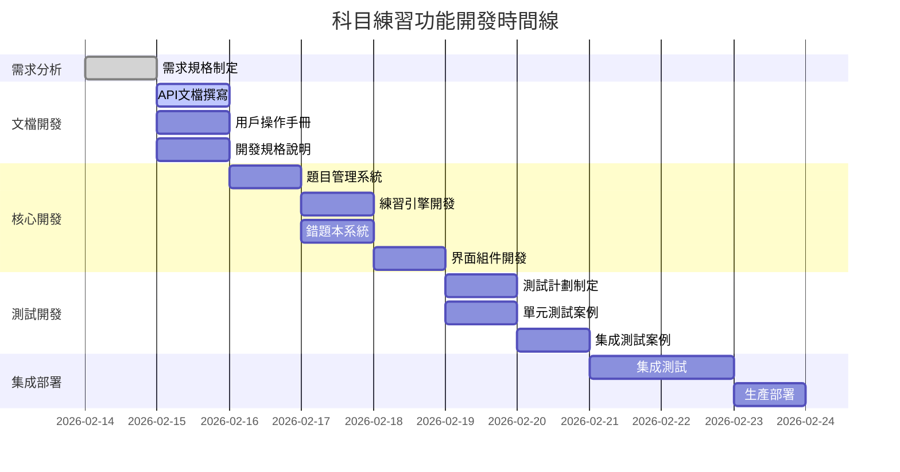

# 📊 科目練習功能專案監控儀表板

## 🎯 專案概覽
| 指標 | 當前值 | 目標值 | 狀態 |
|------|--------|--------|------|
| **總進度** | 10% | 100% | 🟡 |
| **時間進度** | 1/9天 | 9/9天 | 🟢 |
| **預算使用** | 0% | 100% | 🟢 |
| **風險等級** | 低 | 低 | 🟢 |

## 👥 團隊進度監控

### docs-agent (文檔專家)
| 任務 | 進度 | 狀態 | 預計完成 |
|------|------|------|----------|
| API文檔撰寫 | 0% | ⚪ | 2026-02-15 |
| 用戶操作手冊 | 0% | ⚪ | 2026-02-15 |
| 開發規格說明 | 0% | ⚪ | 2026-02-15 |
| 測試案例文檔 | 0% | ⚪ | 2026-02-15 |
| **總進度** | **0%** | **🟡** | **2026-02-15** |

### code-agent (開發專家)
| 任務 | 進度 | 狀態 | 預計完成 |
|------|------|------|----------|
| 題目管理系統 | 0% | ⚪ | 2026-02-16 |
| 練習引擎開發 | 0% | ⚪ | 2026-02-17 |
| 錯題本系統 | 0% | ⚪ | 2026-02-17 |
| 界面組件開發 | 0% | ⚪ | 2026-02-18 |
| 狀態管理系統 | 0% | ⚪ | 2026-02-18 |
| **總進度** | **0%** | **⚪** | **2026-02-18** |

### tester (測試專家)
| 任務 | 進度 | 狀態 | 預計完成 |
|------|------|------|----------|
| 測試計劃制定 | 0% | ⚪ | 2026-02-19 |
| 單元測試案例 | 0% | ⚪ | 2026-02-19 |
| 集成測試案例 | 0% | ⚪ | 2026-02-20 |
| 用戶體驗測試 | 0% | ⚪ | 2026-02-20 |
| 兼容性測試 | 0% | ⚪ | 2026-02-20 |
| **總進度** | **0%** | **⚪** | **2026-02-20** |

## 📅 時間線進度



## ⚠️ 風險監控面板

### 當前風險狀態
| 風險類型 | 等級 | 狀態 | 負責人 | 最後更新 |
|----------|------|------|--------|----------|
| 技術複雜度 | 🟡 中等 | 監控中 | code-agent | 2026-02-14 |
| 時間壓力 | 🟢 低 | 可控 | PM | 2026-02-14 |
| 質量控制 | 🟡 中等 | 監控中 | tester | 2026-02-14 |
| 需求變更 | 🟢 低 | 可控 | PM | 2026-02-14 |

### 風險趨勢
```
技術複雜度風險: ███████░░░ 70% (穩定)
時間壓力風險:   ████░░░░░░ 40% (下降)
質量控制風險:   ██████░░░░ 60% (穩定)
需求變更風險:   ██░░░░░░░░ 20% (下降)
```

## 📈 質量指標監控

### 代碼質量指標
| 指標 | 當前值 | 目標值 | 趨勢 |
|------|--------|--------|------|
| 測試覆蓋率 | 0% | >80% | ➡️ |
| 代碼重複率 | 0% | <5% | ➡️ |
| 靜態分析錯誤 | 0 | 0 | ➡️ |
| 編譯警告 | 0 | 0 | ➡️ |

### 性能指標
| 指標 | 當前值 | 目標值 | 狀態 |
|------|--------|--------|------|
| 頁面加載時間 | - | <3秒 | ⚪ |
| API響應時間 | - | <1秒 | ⚪ |
| 內存使用 | - | <50MB | ⚪ |
| 首次渲染時間 | - | <2秒 | ⚪ |

### 用戶體驗指標
| 指標 | 當前值 | 目標值 | 狀態 |
|------|--------|--------|------|
| 用戶滿意度 | - | >4/5 | ⚪ |
| 任務完成率 | - | >70% | ⚪ |
| 錯誤率 | - | <1% | ⚪ |
| 用戶留存率 | - | >50% | ⚪ |

## 🔄 近期活動記錄

### 2026-02-14 活動
| 時間 | 活動 | 參與者 | 結果 |
|------|------|--------|------|
| 07:10 | 專案啟動會議 | PM | 需求規格確認 |
| 07:12 | 任務分配 | PM | docs-agent, code-agent, tester 已指派 |
| 07:15 | 監控機制設置 | PM | 定時任務配置完成 |
| 07:20 | 用戶溝通 | PM | 專案重新規劃報告發送 |

### 待處理事項
| 事項 | 優先級 | 負責人 | 截止時間 |
|------|--------|--------|----------|
| 檢查 docs-agent 進度 | 高 | PM | 2026-02-15 09:00 |
| 設置代碼審查流程 | 中 | PM | 2026-02-16 |
| 準備測試環境 | 中 | tester | 2026-02-19 |
| 用戶演示準備 | 低 | PM | 2026-02-22 |

## 📊 資源使用情況

### 人力資源
| 角色 | 分配時間 | 使用時間 | 使用率 |
|------|----------|----------|--------|
| PM | 9人天 | 0.5人天 | 5.6% |
| docs-agent | 1人天 | 0人天 | 0% |
| code-agent | 3人天 | 0人天 | 0% |
| tester | 2人天 | 0人天 | 0% |
| **總計** | **15人天** | **0.5人天** | **3.3%** |

### 技術資源
| 資源 | 分配 | 使用 | 狀態 |
|------|------|------|------|
| GitHub存儲庫 | 1個 | 1個 | 🟢 |
| 開發服務器 | 1台 | 0台 | 🟢 |
| 測試環境 | 1套 | 0套 | 🟢 |
| 部署環境 | 1套 | 0套 | 🟢 |

## 🎯 下一步行動

### 今日重點 (2026-02-14)
1. ✅ 完成需求規格文檔
2. ✅ 分配團隊任務
3. ✅ 設置監控機制
4. ✅ 與用戶溝通專案規劃

### 明日計劃 (2026-02-15)
1. 🔄 檢查 docs-agent 文檔進度
2. 🔄 審查文檔質量
3. 🔄 準備開發環境
4. 🔄 更新進度報告

### 本周目標
- **周一 (2/15)**: 文檔交付完成
- **周二 (2/16)**: 核心開發開始
- **周三 (2/17)**: 練習引擎完成
- **周四 (2/18)**: 核心功能完成
- **周五 (2/19)**: 測試開發開始

## 📝 問題與障礙記錄

### 當前問題
| 問題 | 嚴重度 | 狀態 | 負責人 | 創建時間 |
|------|--------|------|--------|----------|
| 無 | - | - | - | - |

### 已解決問題
| 問題 | 解決方案 | 解決時間 | 負責人 |
|------|----------|----------|--------|
| PM直接開發品質問題 | 實施專業分工流程 | 2026-02-14 | PM |

## 🔗 相關文檔鏈接

### 核心文檔
- [需求規格文檔](./REQUIREMENTS_科目練習功能.md)
- [專案狀態報告](./PROJECT_STATUS_科目練習功能.md)
- [團隊任務分配記錄](./TEAM_ASSIGNMENTS.md)

### 技術文檔
- [技術架構設計](./TECH_ARCHITECTURE.md)
- [API文檔](./API_DOCUMENTATION.md) (待創建)
- [測試計劃](./TEST_PLAN.md) (待創建)

### 管理文檔
- [風險管理計劃](./RISK_MANAGEMENT.md)
- [溝通計劃](./COMMUNICATION_PLAN.md)
- [質量保證計劃](./QUALITY_ASSURANCE.md)

---

**儀表板最後更新**: 2026-02-14 07:25 UTC  
**下次自動更新**: 2026-02-15 09:00 UTC  
**更新頻率**: 每日 + 里程碑完成時  
**負責人**: PM  

> **注意**: 此儀表板會自動更新，反映專案最新狀態。如有異常，請立即通知 PM。